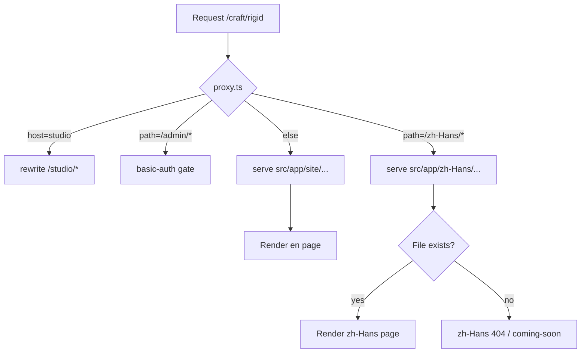

# ADR-0011 — zh-Hans locale migration plan

Status: Proposed
Date: 2026-05-26
Authors: site-engineer agent

## Context

The Huamei SEO playbook (§6.4, §6.2.5, "China locale (zh-Hans)") prescribes
two locales served from the same origin:

- `en` at the root (no prefix) — primary
- `zh-Hans` behind a prefix (`/zh-Hans/...`) — secondary, targeting
  HK / TW / SG / global Mandarin buyers and China-side stakeholders.
  **Mainland Baidu is out of scope** (requires ICP + in-country host).

ADR-0003 (2026-05-04) deferred this migration until "the first Chinese-language
pillar is ready to ship," because:

1. The playbook treats the existing 55 indexed URLs as canonical and any
   re-shape carries redirect / canonical chain risk.
2. The bundle assumed an `app/[lang]/...` shape that did not yet exist.
3. There was no translator (human or agent) committed to producing
   ~2,500 zh-Hans words within 30 days of migration.

As of today the reverse-trigger conditions in ADR-0003 are partially met:

- **Met:** ≥3 brand-line proposals Accepted, ≥1 stable English pillar
  shipped, **83 English `/blogs/*` articles published** (well above the
  3-post cold-start threshold).
- **Not yet met:** no committed translator with capacity for a sustained
  zh-Hans content load. A `translator` subagent role exists in
  `SEO_TEAM_MAP.md` but has not produced shippable pillar copy.
- **New factor:** founder is a native Mandarin speaker. zh-Hans review
  capacity is no longer an external dependency — founder review is the
  rate-limiter.

This ADR proposes the migration plan. It does NOT execute the migration.
A separate execution PR follows once the founder confirms the plan and
schedules Phase 1.

## Decision (proposed)

Adopt a **dual-locale, prefix-only-on-secondary** routing model:

| Locale | URL shape | Default? | Initial content |
|---|---|---|---|
| `en` | `huamei.io/<path>` (no prefix) | Yes | All existing 83 blogs + craft/industry/volumes/house |
| `zh-Hans` | `huamei.io/zh-Hans/<path>` | No | Phase 1: empty (404 / coming-soon). Phase 2+: progressive fill. |

Rationale for asymmetric prefixing (no `/en/` prefix, only `/zh-Hans/`):

- **Preserves all 55+ canonical English URLs.** Zero 301s, zero
  link-equity churn. This is the key advantage over the playbook's
  v3 §6.2.5 proposal (which redirected everything to `/en/`).
- **Standard pattern.** Vercel, Shopify, Stripe, and many other
  multinational sites use no-prefix-default. Google handles it cleanly
  via `hreflang` with the `en` and `x-default` both pointing at the
  un-prefixed URL.
- **Cheaper to ship.** No redirect map, no sitemap dual-publish window,
  no verification of 55 chains.

Trade-off accepted: when we later add a third locale (e.g. `ja`, `ko`,
`zh-Hant`), it also goes under a prefix. The English root is permanent.

## Routing architecture

### File-system shape

**Current (do not change in this ADR):**
```
src/app/
  layout.tsx                 # root HTML lang="en", JSON-LD org graph
  (site)/
    layout.tsx               # UtilityBar, PrimaryNav, Footer
    page.tsx                 # homepage
    craft/, industry/, blogs/, volumes/, house/, begin/, ...
  api/
  studio/
  admin/
  robots.ts, sitemap.ts, opengraph-image.tsx
```

**Proposed (target after Phase 1 ships):**
```
src/app/
  layout.tsx                 # root HTML — lang attr now reads from segment
  (site)/                    # UNCHANGED — serves the en root
    layout.tsx
    page.tsx
    craft/, industry/, blogs/, volumes/, house/, ...
  zh-Hans/                   # NEW — literal segment (not [lang])
    (site)/
      layout.tsx             # zh-Hans chrome + lang="zh-Hans"
      page.tsx               # zh-Hans homepage (Phase 2)
      craft/, industry/, ... # Mirror the en tree, fill progressively
    not-found.tsx            # Localized 404
  api/, studio/, admin/, ...
```

**Why a literal `zh-Hans` segment instead of `[lang]`:**

We considered `src/app/[lang]/(site)/...` per the Next 16 i18n guide.
Rejected because:

1. It forces the English root under `/en/` (the v3 §6.2.5 problem).
2. It complicates the proxy: we'd have to special-case "no `[lang]`
   means en" or "redirect / to /en", and that triggers the 55-URL
   redirect work we want to avoid.
3. A literal `/zh-Hans/` segment is just a route prefix. The English
   tree stays exactly where it is. Each tree compiles independently.
4. Next 16's route-group conventions support this cleanly — the
   `(site)` group can appear under both the root and `zh-Hans/`.

Locale type is centralized in `src/lib/i18n.ts` (new) so adding a third
locale later is mechanical:

```ts
// src/lib/i18n.ts (sketch — DO NOT IMPLEMENT IN THIS ADR)
export const LOCALES = ["en", "zh-Hans"] as const;
export type Locale = (typeof LOCALES)[number];
export const DEFAULT_LOCALE: Locale = "en";
export function isLocale(s: string): s is Locale {
  return (LOCALES as readonly string[]).includes(s);
}
```

### Proxy / locale detection

`src/proxy.ts` already exists for the `studio.huamei.io` host rewrite and
`/admin/*` basic-auth gate. The locale migration **adds one rule and
nothing else**:

```
incoming request → proxy.ts
  ├── host == studio.huamei.io? → rewrite to /studio (existing)
  ├── path starts with /admin? → basic-auth gate (existing)
  ├── path starts with /zh-Hans? → pass through, serve zh-Hans tree
  └── else → pass through, serve en tree (the default)
```

**No Accept-Language sniffing.** The proxy does NOT auto-redirect en
visitors to `/zh-Hans` based on browser language. Three reasons:

1. **SEO.** Google warns against language-based redirects — they trip
   the crawler, which always presents `en-US` Accept-Language and
   would then never see the zh-Hans pages.
2. **HK/TW/SG buyer behavior.** Many native Mandarin speakers in these
   markets use English-default browsers but read both. Forcing them
   to zh-Hans is wrong.
3. **Simpler caching.** No `Vary: Accept-Language` header needed; CDN
   caches the URL cleanly.

Locale switching is **explicit only** — a "中文 / EN" link in the
footer (and optionally the utility bar) that flips between the current
path and its localized counterpart.



### Sitemap impact

`src/app/sitemap.ts` (currently emits 55+ en URLs) becomes:

- For each existing en URL, also emit `https://huamei.io/zh-Hans/<path>`
  ONLY if the zh-Hans page actually exists on disk (file check, same
  pattern as the existing `publicFileExists` guard for blog hero
  images).
- Add `alternates: { languages: { en: ..., 'zh-Hans': ... } }` to
  every URL entry that has a zh-Hans counterpart (Next 16 sitemap
  metadata supports this — renders as `<xhtml:link rel="alternate"
  hreflang="...">`).
- Add `x-default` pointing at the en URL.

Per-page `Metadata.alternates.languages` mirrors the same shape so
`<head>` link tags match the sitemap.

### 301/302 redirects

**None.** Existing English URLs stay at root. This is the load-bearing
property of the asymmetric-prefix decision.

The only redirect added: optional `/en` → `/` and `/en/<path>` → `/<path>`
(permanent) to catch any inbound links that assume an `/en/` prefix.
This is defensive only; we don't expect such links to exist.

## Data layer changes

For each module, what the locale-aware shape looks like.

### `src/lib/i18n.ts` (new)

Owns the `Locale` type, the locale list, default, and helpers
(`isLocale`, `getDictionary`, `localizePath`). Single import path for
every other module.

### `src/lib/topics.ts` (767 lines)

Today: `TOPIC_COPY` is a flat `Record<slug, TopicCopy>`.

Target shape:

```ts
// Sketch — do not implement in this ADR.
export const TOPIC_COPY: Record<Locale, Record<TopicSlug, TopicCopy>> = {
  en:        { rigid: {...}, magnetic: {...}, ... }, // existing data
  "zh-Hans": { rigid: {...}, magnetic: {...}, ... }, // new, fills over time
};
export function getTopic(lang: Locale, slug: string): Topic | null { ... }
```

**Fallback behavior:** if `TOPIC_COPY["zh-Hans"][slug]` is undefined,
`getTopic("zh-Hans", slug)` returns `null` and the route renders the
zh-Hans 404 (NOT the English page). We do not want a half-translated
page silently serving English copy. Phase 2 ships UI chrome but pages
without translated topic data still 404 on the zh-Hans side.

### `src/lib/volumes.ts` (48 lines, 28 case studies)

`Volume.name`, `Volume.tag`, `Volume.category` are user-facing strings
and need locale variants. `Volume.client`, `Volume.slug`, `Volume.num`
stay locale-invariant (client names are proper nouns; slugs are URLs;
roman numerals are universal).

Two options:

- **A. Inline localization on the type.** `name: { en: "...", "zh-Hans": "..." }`
  — verbose but co-located.
- **B. Separate `VOLUMES_ZH_HANS` table keyed by slug.** Easier diff;
  easier "what's translated, what's not" reporting.

**Recommended: B.** Keeps the en file unchanged, makes the zh-Hans
data a pure additive PR.

Note: Sanity (the CMS for AI-generated volumes per ADR-0007) also needs
a locale field on the schema. Sanity's `internationalization-array`
plugin handles this cleanly. Surface as a Phase 1 Sanity-schema change.

### `src/lib/blogs.ts` (88 lines, 83 articles in `content/blogs/`)

Two shape options:

- **A. Sibling files.** `content/blogs/foo.md` + `content/blogs/foo.zh-Hans.md`.
  Loader picks based on lang.
- **B. Separate dir.** `content/blogs/<slug>.md` (en) +
  `content/blogs/zh-Hans/<slug>.md` (zh-Hans).

**Recommended: B.** Cleaner `ls`, easier to count "how many zh-Hans
articles do we have?", and the en tree stays untouched. The loader
becomes:

```ts
// Sketch.
const CONTENT_DIR = path.join(process.cwd(), "content", "blogs");
function read(slug: string, lang: Locale = "en"): BlogPost | null {
  const file = lang === "en"
    ? path.join(CONTENT_DIR, `${slug}.md`)
    : path.join(CONTENT_DIR, lang, `${slug}.md`);
  // ...
}
```

`getAllBlogPosts(lang)` returns only posts that exist in that locale.
Sitemap iterates each locale's set; `alternates.languages` declared
only for posts that exist in both.

### `src/lib/nav.ts` (133 lines)

`navCategories` exports the primary nav copy. Becomes
`navCategories: Record<Locale, NavCategory[]>`, or a localizer function
`getNavCategories(lang)` that reads from a per-lang dictionary.

The roman numerals (`i.`, `ii.`) stay universal. Brand names like
"Souverain", "Wuliangye" stay English (see Open Questions below).

### `src/lib/schema/*.ts`

JSON-LD payloads — `organization.ts`, `article.ts`, `service.ts`,
`breadcrumbs.ts`. Each needs an `inLanguage` field:

```ts
{ "@type": "Article", "inLanguage": "zh-Hans", ... }
```

And the `url` field needs the `/zh-Hans/` prefix for zh-Hans pages.
Builders take `lang` as an argument and produce the right shape.

### `src/components/*` (UI chrome)

`UtilityBar`, `PrimaryNav`, `Footer`, `Hero`, etc. — all currently
hard-code English strings. Pass `lang` from layout via props or read
from a server-side dictionary (`src/dictionaries/en.json`,
`src/dictionaries/zh-Hans.json`). The Next 16 i18n guide pattern with
`getDictionary(lang)` applies directly.

## Content strategy

### Phase A — UI chrome only

Bilingual translations for nav, footer, page titles, button labels,
form copy. **No article content.** Pages under `/zh-Hans/blogs/...`
return 404 (or a soft "Coming soon — see English" page that links to
the en counterpart). Estimate: 1-2 days, ~500 source strings.

### Phase B — pillar translations

Translate the 4 pillars manually (founder + translator agent):
P1 Custom Luxury Rigid Box, P2 Hot-Foil & Surface Finishing,
P3 Sustainable Luxury Packaging, P4 Working with a Chinese Manufacturer.
~10,000 words total. Founder reviews each (he's the native speaker).
Estimate: week 1 of Phase B.

### Phase C — cluster machine-translation with editor review

Translate the remaining 79 articles via Claude with the `translator`
agent + founder spot-review (sample 20%, full-review the
high-trust articles like /volumes/* case studies). ~150,000 words.
Estimate: weeks 2-4 of Phase B/C, possibly batched across the
daily-publish routine.

### Phase D — zh-Hans-native articles

Some topics are zh-Hans-native and shouldn't be translated FROM English:
baijiu category deep-dives, CNY / Mid-Autumn / Dragon Boat gifting,
Chinese paper-mill heritage, regional craft traditions. These start
life in zh-Hans and may or may not get translated TO English later.
Ongoing.

### Total content budget

- **Founder review time:** 20-30 hours for the bilingual launch
  (Phase A + B + pillar review). Cluster translation review adds
  ~40-60 hours spread over weeks.
- **Editor (Opus) runtime:** 6-8 weeks for the bulk translate.
- **Outcome:** by week 8, the full English site is mirrored in
  zh-Hans, plus 10-20 zh-Hans-native articles.

## SEO implications

### hreflang setup

Every page that exists in both locales emits a pair of `<link rel="alternate">` tags:

```html
<link rel="alternate" hreflang="en" href="https://huamei.io/craft/rigid" />
<link rel="alternate" hreflang="zh-Hans" href="https://huamei.io/zh-Hans/craft/rigid" />
<link rel="alternate" hreflang="x-default" href="https://huamei.io/craft/rigid" />
```

Pages that exist in only one locale emit only the existing pair plus
`x-default` to whichever locale exists. **Asymmetric hreflang is a
common Google warning** — gate the alternate emission on file existence.

### Canonical URL rules

- en pages: canonical to themselves at root.
- zh-Hans pages: canonical to themselves at `/zh-Hans/...`.
- No cross-locale canonicalization. Canonical and hreflang together
  signal "these are translations, not duplicates."

### GSC properties

For domain-property GSC (which Huamei has), zh-Hans coverage shows up
automatically once URLs are indexed. No second property needed.

If we move to URL-prefix property later, we'd need a separate prefix
property for `https://huamei.io/zh-Hans/` to filter zh-Hans queries.
Not urgent.

### Sitemap

Single `sitemap.xml` that includes both locales with `xhtml:link`
alternate tags per URL. Next 16's MetadataRoute.Sitemap supports
`alternates.languages` natively.

### Risk: split signal

`/blogs/foo` and `/zh-Hans/blogs/foo` are conceptually the same
article. Without hreflang Google might rank only one or hide the
other in different SERPs. With hreflang correctly emitted Google
clusters them and serves the right one per user-locale.

Worst case in the first 30 days: Google indexes only the en pages
and the zh-Hans pages sit pending. **Acceptable.** Indexing latency
for the zh-Hans tree is the primary risk and there's nothing we can
do about it short of submitting to Bing Webmaster Tools too (which
we already do).

### IndexNow

The daily-publish routine pings IndexNow with new URLs. After Phase 2,
each new zh-Hans article gets its own ping. Already supported by the
ping payload format; no code change beyond passing the URL.

## Risks + open questions

Founder needs to answer these before Phase 2 execution starts:

1. **Brand-name rendering.** Wuliangye, Yangshao, Dukang, Hongxing,
   T2 — on `/zh-Hans/volumes/wuliangye`, do we render `Wuliangye`
   (Pinyin) or `五粮液` (Hanzi)? Recommendation: Hanzi first mention,
   Pinyin in parens. Decision needed for every entry on the
   authorized client roster.
2. **Sonia Sun byline.** Is it `孙X (Sonia Sun)` on zh-Hans pages?
   Founder's preferred Hanzi name needed.
3. **Locale switcher placement.** Footer-only, or also in the utility
   bar / primary nav? Most luxury sites use footer; some use a top-
   right utility link.
4. **Soft 404 vs hard 404 for untranslated pages.** If `/zh-Hans/craft/rigid`
   has no zh-Hans content yet, do we (a) return 404, (b) return a
   "coming soon — see English" page that links to the en, or
   (c) 302 to the en URL with a banner? Recommendation: (b) for the
   first 60 days, then (a) once we've translated the pillars.
   **(c) is rejected — it confuses GSC and hreflang.**
5. **Daily publish routine output.** Should the 10am-PT routine
   publish 5 en/day AND 5 zh-Hans/day (10 total), 5 en + 1 zh-Hans
   (light tail), alternate days, or stop at 5 en until the backlog
   translation completes? Recommendation: start at 5 en + 0 zh-Hans
   (no change), introduce zh-Hans into the routine in Phase C.
6. **Cover photos / hero imagery.** Are case-study photos shared
   across locales (same `/photos/cases/<slug>/01.jpg`) or do we want
   localized alt text only? Recommendation: shared images, localized
   alt text. Already supported by the image strategy in playbook §6.6.
7. **OG image localization.** Does each /blogs/<slug>/opengraph-image.tsx
   need a zh-Hans variant? The current image is text-on-image with
   English. Recommendation: yes, but treat as Phase B polish, not
   Phase 1 blocker.
8. **Numerals.** Article body says "22,000 m²" and "3,000+ employees".
   Localize to "2.2萬平方米" and "3,000+ 名員工"? Recommendation:
   keep Arabic numerals; localize the unit + label.
9. **Date format.** Visible publication dates: `Published 2026-05-13`
   en vs `发布于 2026年5月13日` zh-Hans?
10. **Banned brand names in zh-Hans.** Kurz, Crown, Lancôme,
    L'Oréal, Estée Lauder are banned in en per CLAUDE.md. The same
    list applies to zh-Hans — confirm the Hanzi spellings are also
    banned (兰蔻, 欧莱雅, 雅诗兰黛).

## Phased rollout

Each phase is independently deployable and reversible.

### Phase 1 — routing scaffold + locale chrome (NO content)

One PR. Adds:
- `src/lib/i18n.ts` (Locale type, helpers)
- `src/app/zh-Hans/(site)/layout.tsx` (zh-Hans chrome shell)
- `src/app/zh-Hans/(site)/page.tsx` ("Coming soon" placeholder, lang="zh-Hans")
- `src/app/zh-Hans/not-found.tsx`
- Update `src/app/layout.tsx` to keep en as root
- Update `src/proxy.ts` if any path-detection logic is needed (likely
  none — Next 16 file-tree routing handles `/zh-Hans/` automatically)
- Update `src/app/sitemap.ts` to include the `/zh-Hans` placeholder
  homepage with `hreflang` alternate pair
- Update `src/app/robots.ts` if needed (currently allows everything;
  no change expected)

**SEO impact:** zero. The only new URL is `huamei.io/zh-Hans` which
serves a single coming-soon page. Existing English URLs are untouched.

**Reversal:** revert the PR. No data migration to undo.

### Phase 2 — UI chrome translation

Multiple PRs (one per component family):
- `src/dictionaries/en.json` (extract all hard-coded en strings)
- `src/dictionaries/zh-Hans.json` (translations)
- Refactor `PrimaryNav`, `Footer`, `UtilityBar`, `Hero` to read from
  the dictionary
- Locale switcher component in footer
- Localize `next.config.ts` metadata defaults if needed
- Localize `src/lib/schema/*.ts` to take `lang`

**Outcome:** `/zh-Hans/` renders the full site chrome in Chinese but
all interior pages still 404 on the zh-Hans side.

### Phase 3 — pillar translations

One PR per pillar (or batched 2 at a time):
- P1, P2, P3, P4 zh-Hans versions live at
  `content/blogs/zh-Hans/<slug>.md`
- Translate the supporting craft/industry/house pages cited by each
  pillar (so the internal links don't dead-end)
- Update `getTopic` and the topic copy table per the data-layer plan
  above

**Outcome:** `/zh-Hans/blogs/custom-luxury-rigid-box-manufacturing` etc.
render fully. About 20-30% of the zh-Hans tree is live.

### Phase 4 — cluster translation + zh-Hans-native articles

Ongoing. Daily publish routine may add zh-Hans output once the
translator agent has demonstrated stable quality.

## Effort estimate

| Phase | Engineer time | Editor (Opus) time | Founder review |
|---|---|---|---|
| 1 — routing scaffold | 8h | 0 | 2h (review the PR) |
| 2 — UI chrome | 16h | 4h (string review) | 4h (Hanzi proofread) |
| 3 — pillar translations | 8h (route wiring) | 40h (4 pillars + cited subpages) | 20h (pillar review is high-stakes) |
| 4 — cluster + native | 4h/week (ongoing maintenance) | Ongoing — folds into the daily routine | Ongoing — spot-check 20% |

Total to "bilingual launch" (Phase 1+2+3): ~32 engineer hours +
~44 Opus hours + ~26 founder hours, over 6-8 weeks.

## Decision

**Recommended path:**

1. **Ship Phase 1 immediately** once founder confirms. It's a low-risk
   routing-only PR with zero SEO impact and unblocks all subsequent work.
2. **Defer Phase 2 until founder explicitly schedules it.** Phase 2
   needs the founder's Hanzi-version preferences (brand names,
   Sonia Sun byline, banned-phrase Hanzi equivalents).
3. **Defer Phase 3 and 4** until Phase 2 is stable for ≥2 weeks
   (we want to see GSC zh-Hans crawl behavior before committing
   pillar translation effort).

This staged approach mirrors how Phase 1 of the original playbook was
handled — small reversible commits, gate Phase 2 on founder review.

## Alternatives considered

### A. Subdomain (`zh.huamei.io`)

Rejected. Pros: independent host, easier to firewall (mainland
considerations later). Cons: backlink equity does not transfer between
subdomains as cleanly as between subdirectories; needs separate GSC
property; needs separate Vercel project or domain alias; complicates
the `studio.huamei.io` rewrite logic in `src/proxy.ts`. Subdirectory
is the Google-recommended pattern for "same brand, different locale."

### B. Separate domain (`huamei.com.hk` or similar)

Rejected. Pros: territory-targeted ccTLD signal. Cons: doubles every
infrastructure cost (DNS, certs, GA4 properties, GSC, IndexNow keys).
Not justified for the HK/TW/SG addressable market size. Revisit only
if HK becomes a >40% revenue source.

### C. Client-side i18n library (e.g. `next-intl`)

Rejected for URL-shape, accepted for dictionary loading. We won't use
`next-intl`'s routing layer — the Next 16 native file-tree pattern is
simpler. We may use `next-intl`'s message-formatting utilities
(pluralization, dates) inside `getDictionary` if the built-in
`Intl.*` browser APIs prove insufficient. Decision deferred to Phase 2.

### D. `app/[lang]/(site)/...` with `/en/` prefix on English

Rejected. Triggers the 55-URL 301 migration from playbook §6.2.5,
which carries non-zero link-equity risk for zero present value. The
asymmetric-prefix model (this ADR's decision) avoids that risk entirely.

### E. Translate everything in one big-bang PR

Rejected. Translation quality risk + founder review bandwidth makes
this infeasible. Phased rollout per the plan above is mandatory.

## How agents apply this

- **site-engineer:** when this ADR moves to Accepted and Phase 1 is
  scheduled, the execution PR follows. New routes after Phase 1 are
  created in both `src/app/(site)/...` (en) and `src/app/zh-Hans/(site)/...`
  (zh-Hans) only if zh-Hans content exists; otherwise en-only is fine
  (sitemap gates zh-Hans emission on content existence).
- **editor:** continues drafting in en under `content/blogs/`.
  zh-Hans drafts go to `content/blogs/zh-Hans/`. The daily publish
  routine does NOT auto-publish zh-Hans drafts until Phase 4.
- **translator:** activates in Phase 2. Brand-line proposals in
  `.seo/reference/brand-lines.md` remain the input source.
- **outreach:** zh-Hans-targeted outreach (HK trade press, TW
  directories) is a Phase 4+ activity. No change to en outreach.
- **analyst:** GSC zh-Hans queries become a new monthly-report
  section starting in Phase 2.

## Trigger to revisit

Reverse the deferral on subsequent phases when:

- Phase 1 has been live ≥2 weeks with no SEO regression (GSC
  impressions stable, no Coverage errors on the en tree).
- Founder has answered the 10 open questions above.
- Founder has scheduled ≥20 hours/month of zh-Hans review capacity
  for the next quarter.

## References

- `.seo/playbook.md` §6.2.5, §6.4, "China locale (zh-Hans)"
- `.seo/SEO_CONTEXT.md` — locale-naming rules (zh-Hans only,
  no `zh` or `zh-CN`)
- `.seo/decisions/0003-defer-locale-prefix-migration.md` — original
  deferral
- `.seo/decisions/0007-sanity-cms-for-volumes.md` — Sanity is the
  CMS for /volumes; needs locale schema update in Phase 2
- `node_modules/next/dist/docs/01-app/02-guides/internationalization.md`
  — Next 16 i18n guide (consulted for current routing patterns)
- `SEO_TEAM_MAP.md` — translator agent definition
